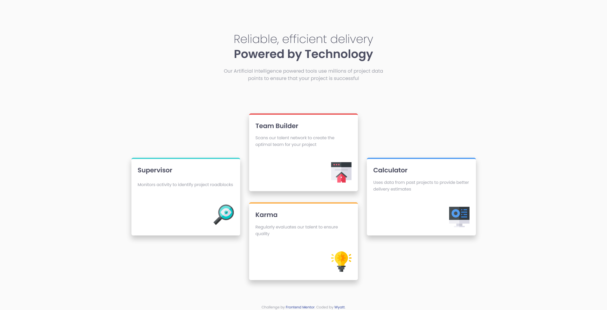

# Frontend Mentor - Four card feature section solution

This is a solution to the [Four card feature section challenge on Frontend Mentor](https://www.frontendmentor.io/challenges/four-card-feature-section-weK1eFYK). Frontend Mentor challenges help you improve your coding skills by building realistic projects. 

## Table of contents

- [Overview](#overview)
  - [The challenge](#the-challenge)
  - [Screenshot](#screenshot)
  - [Links](#links)
- [My process](#my-process)
  - [Built with](#built-with)
  - [What I learned](#what-i-learned)
  - [Continued development](#continued-development)
  - [Useful resources](#useful-resources)
- [Author](#author)

## Overview

### The challenge

Users should be able to:

- View the optimal layout for the site depending on their device's screen size

### Screenshot



### Links

- Solution URL: [Responsive Layout Using CSS-Grid & BEM](https://www.frontendmentor.io/solutions/responsive-layout-using-cssgrid-and-bem-rw3dLt0s3K)
- Live Site URL: [Frontend Mentor | Four card feature section](https://00wyatt.github.io/fem-four-card-feature/)

## My process

### Built with

- Semantic HTML5 markup
- CSS custom properties
- CSS Grid
- Mobile-first workflow

### What I learned

I am a beginner coder, and I've starting with the newbie challenges. I have completed a few challenges on Frontend Mentor, but I haven't yet submitted any of my solutions until now. I wanted to submit one just to see how it works.

In this challenge I used CSS-Grid, which I have recenty started learning. I only needed the basics, but this challenge seemed like a good opportunity to try and create something responsive.

I also had a crack at using BEM, which I think I get the gist of how it works. To me, it makes sense why it's used, and I like the structure it gives to my classes.

Accesibility is another area I am working on, I tried my best to make the page responsive and accessible. In particular, I have been looking at where px, rem, and em should be used. I have used rem for all fonts, and my container's max-width. Px for all other spacing and sizes. And em for my breakpoints, I wanted the responsive layout to change with any font scaling so that everything still fit on the page nicely.

If anyone has any feedback they can offer on these three areas, or on anything else they can see in my code, please let me know.

Some code I was wondering about, is how I wrote this so I can style the page heading:

```html
<h1 class="heading__title"><span class="heading__title--light">Reliable, efficient delivery </span>Powered by Technology</h1>
```
Does anyon know if this is a good way to do it or not? Or if there are any other ways you can suggest?

Thanks.

### Continued development

I want to get some more CSS-Grid practise in, and Flexbox too.

I will continue to complete more Frontend Mentor challenges, working my way onto harder ones. They have been really great for getting some practise in. I should be able to submit some more solutions now that I know how it works!

### Useful resources

- [Don’t use rem/em for paddings, margins and more](https://medium.com/@sascha.wolff/dont-use-rem-em-for-paddings-margins-and-more-94e19026b000) - I liked this article I found by Sascha Wolff, on when to use rem and em. It's a quick read and a sound opinion on the subject.
- [CSS Grid.](https://cssgrid.io/) - For anyone wanting to master CSS-Grid, check out Wes Bos's free course. It helped me a lot!

## Author

- Frontend Mentor - [https://www.frontendmentor.io/profile/00Wyatt]